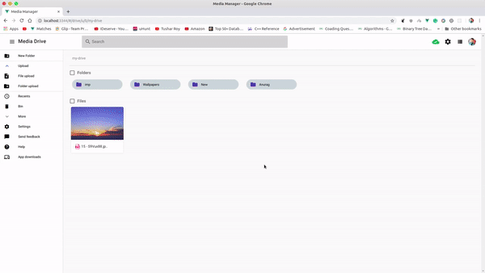

  

<h2 align="center">Lazy Drive</h2>
  
**Note:** This loopback branch is under development because of addition of new UI, Loopback,Docker, Micro service and many more cool new features but, this was managed my small community :( LAMO Its me only :P

**Lazy Drive** is an **opensource** project. Contributions are welcome

- Fork the repo and star it :star:
- Open issues :boom:
- Raise PRs for issues :raised_hand:
- Help on documentation :page_facing_up:

  

For sample you can use [**master**](https://github.com/lazyDrive/drive/tree/master) branch which is not perfect yet but better than this.

Copyright (c) 2019, Lazy Drive [Lazy Drive](http://github.com/lazyDrive/)
