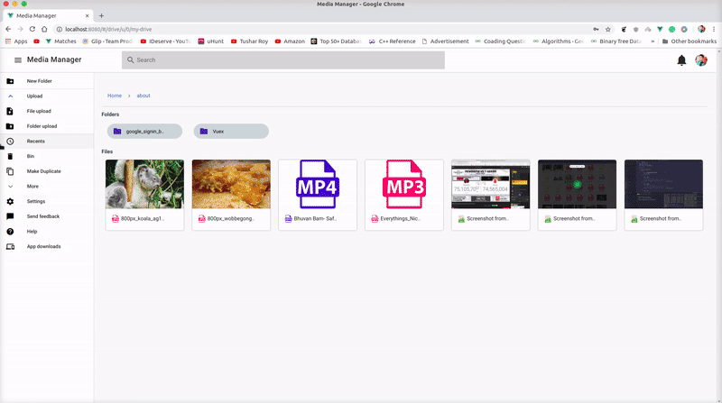

<h2 align="center">Media Drive</h2>

  

  

 

  

### Directory layout

    .
    ├── docs                    # Documentation files (alternatively `doc`)
    ├── public                  # Public files
    ├── server                  # Server of application
    ├── src                     # Source files (alternatively `lib` or `app`)
    ├── test                    # Automated tests (alternatively `spec` or `tests`)
    ├── LICENSE
    └── README.md

## Vue CLI-3 Install

    # npm
    npm install -g @vue/cli

## Installation

    # Install imagemagick
    `sudo apt-get install imagemagick ghostscript poppler-utils`

    # In root and server run
    `npm install`

    # In server folder run
    `npm start`

    # In root run
    `npm run serve`

    # Done! Magic happens on port: `http://localhost:8080`

## To start a development server desktop app with electron:

if you use NPM:

`npm run electron:serve`

To build your app:

`npm run electron:build`

## Production

    # In root run
    `npm run build`

    It build fresh production package in server public folder for you. Then run your server in server folder using this command.
    `npm run drive

## License

[MIT](http://opensource.org/licenses/MIT)

Copyright (c) 2018, Anurag Kumar [anu1601cs](http://github.com/anu1601cs/)
